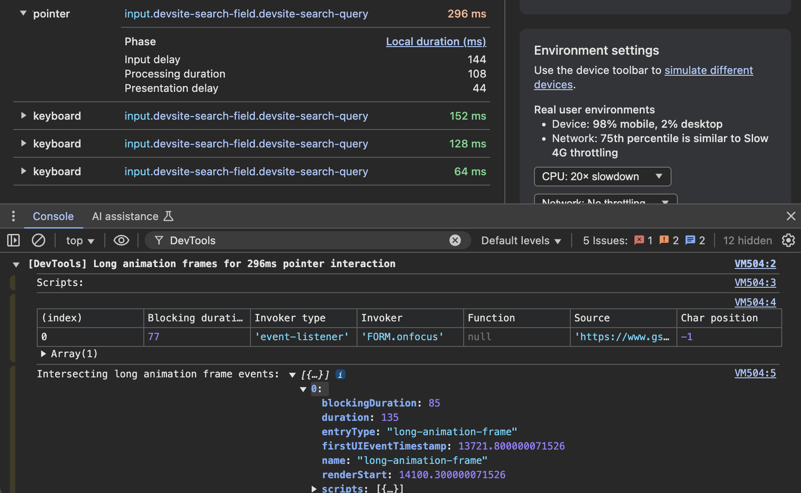
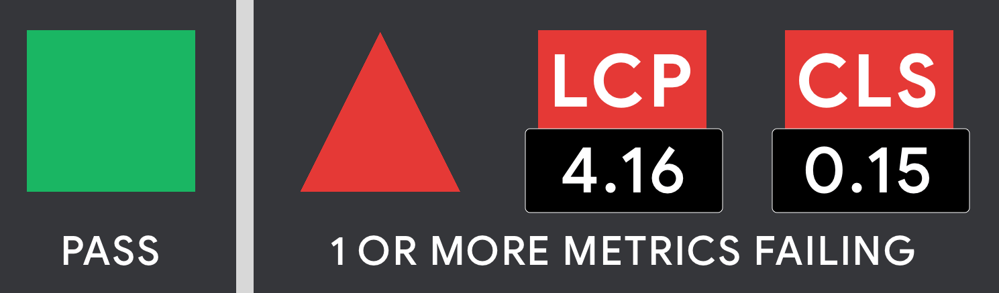
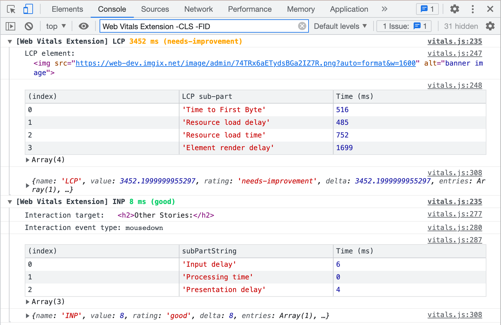

> [!WARNING]
> The Chrome team has been working hard to bring the best of the Web Vitals extension directly into the DevTools Performance panel. As of Chrome version 132, which became stable on January 7, 2025, we have finally ended support for the extension and encourage all users to [switch to DevTools](#devtools). Be aware that extension updates will stop and features may break without notice. [Learn more](https://developer.chrome.com/blog/web-vitals-extension)

# Web Vitals Chrome Extension 
*A Chrome extension to measure metrics for a healthy site* 


This extension measures the three [Core Web Vitals](https://web.dev/articles/vitals) metrics in a way that matches how they're measured by Chrome and reported to other Google tools (e.g. [Chrome User Experience Report](https://developer.chrome.com/docs/crux), [Page Speed Insights](https://developers.google.com/speed/pagespeed/insights/), [Search Console](https://search.google.com/search-console/about)).

It supports all of the [Core Web Vitals](https://web.dev/articles/vitals/#core-web-vitals) and leverages the [web-vitals](https://github.com/GoogleChrome/web-vitals) library under the hood to capture:

* [Largest Contentful Paint](https://web.dev/articles/lcp)
* [Cumulative Layout Shift](https://web.dev/articles/cls)
* [Interaction to Next Paint](https://web.dev/articles/inp)

It also supports the diagnostic metrics:
* [Time to First Byte](https://web.dev/articles/ttfb)
* [First Contentful Paint](https://web.dev/articles/fcp)

<h3 id="devtools">✅ Migrating to DevTools</h3>

Now that the Web Vitals extension has reached "end of life" stage, the Chrome team has stopped maintaining it. All users are strongly encouraged to start using the comparable functionality built into the DevTools Performance panel instead.

The Performance panel is a much more powerful debugging tool than the extension alone. That said, there may be some functional or ergonomic features of the extensions still missing from DevTools. If there's a critical feature of the extension blocking your migration to DevTools, please +1 the relevant feature request in the [hotlist](https://goo.gle/devtools-live-cwv-hotlist) or [file a new issue](https://issues.chromium.org/issues/new?component=1457310&template=1946799&type=feature_request&priority=P2&pli=1&title=Live%20Metrics) to help get it prioritized.


Refer to the [official DevTools Performance panel documentation](https://developer.chrome.com/docs/devtools/performance/overview) for information about using each feature. As of Chrome 132 in January 2025, here is a quick summary of the extension features supported by DevTools:

#### Live metrics

When you open the Performance panel, the view defaults to showing a live look at your local Core Web Vitals metrics.


#### Field data

Use the "Field data" configuration flow to show field data from CrUX next to your local metrics. URL and origin-level data is available for both desktop and mobile.


#### LCP element attribution

You can find a reference to the element responsible for the LCP metric at the bottom of the LCP section.


#### LCP phases

Hover over the LCP metric values to display a card with more information about your local and field LCP performance, including a breakdown of your local LCP phases: TTFB, load delay, load duration, and render delay.


#### Interaction log

Every interaction that get counted towards the INP metric will be added to the interaction log at the bottom of the panel.


#### Interaction phases

Phases for each interaction (including the one responsible for INP) are available by expanding the entry in the interaction log. Supports input delay, processing duration, and presentation delay.


#### LoAF attribution

From the expanded interaction log, the "Local duration (ms)" heading will be clickable if there is LoAF attribution data available. Clicking it will log the data to the Console panel.



#### Layout shift log

Adjacent to the interaction log is the layout shift log, which groups coincidental layout shifts into clusters and assigns a score to the cluster. The worst cluster corresponding to the page's CLS score is linked from the CLS section.


#### TTFB

TTFB is available as a phase of LCP on the live metrics view as well as the trace view under the "LCP by phase" insight.


#### FCP

FCP is shown as a marker in the trace view.


<h3 id="self">⚠️ Self-maintenance instructions</h3>

If you're unable to migrate your workflow to DevTools for any reason, please let us know by following the instructions in the previous section to file an issue. Until your issue gets resolved, you may prefer to continue using the extension using a local copy.

To get started, follow the instructions below to [install the extension from source](#install-master).

To continue using field data powered by the CrUX API, you'll need to provision a new API key tied to a personal Google Cloud project. You can acquire a new key by visiting the [CrUX API docs](https://developer.chrome.com/docs/crux/api#APIKey). It doesn't cost anything to use the API, but rate limiting restrictions will apply.

To stay up to date with the [web-vitals.js library](https://github.com/GoogleChrome/web-vitals), periodically run the following command:

```sh
npm update web-vitals --save
```

<h3 id="install-master">Install from main</h3>

**Google Chrome**
1. Download this repo as a [ZIP file from GitHub](https://github.com/googlechrome/web-vitals-extension/archive/main.zip).
1. Unzip the file and you should have a folder named `web-vitals-extension-main`.
1. In Chrome go to the extensions page (`chrome://extensions`).
1. Enable Developer Mode.
1. Drag the `web-vitals-extension-main` folder anywhere on the page to import it (do not delete the folder afterwards).

## Usage

### Ambient badge



The Ambient Badge helps check if a page passing the Core Web Vitals thresholds.

Once installed, the extension will display a disabled state badge icon until you navigate to a URL. At this point it will update the badge to green, amber or red depending on whether the URL passes the Core Web Vitals metrics thresholds.

The badge has a number of states:

* Disabled - gray square
* Good - green circle
* One or more metrics needs improvement - amber square
* One or more metrics poor - red triangle

If one or more metrics are failing, the badge will animate the values of these metrics (this animation can be turned off in the options screen).

### Detailed drill-down


Clicking the Ambient badge icon will allow you to drill in to the individual metric values. In this mode, the extension will also say if a metric requires a user action.

For example, Interaction to Next Paint requires a real interaction (e.g click/tap) with the page and will be in a `Waiting for input...` state until this is the case. We recommend consulting the web.dev documentation for [LCP](https://web.dev/articles/lcp), [CLS](https://web.dev/articles/cls), and [INP](https://web.dev/articles/inp) to get an understanding of when metric values settle.

The popup combines your local Core Web Vitals experiences with real-user data from the field via the [Chrome UX Report](https://developer.chrome.com/docs/crux) (CrUX) [API](https://developer.chrome.com/docs/crux/api). This integration gives you contextual insights to help you understand how similar your individual experiences are to other desktop users on the same page. We've also added a new option to "Compare local experiences to phone field data" instead, if needed. Note that CrUX data may not be available for some pages, in which case we try to load field data for the origin as a whole.


### Overlay


The overlay displays a Heads up display (HUD) which overlays your page. It is useful if you need a persistent view of your Core Web Vitals metrics during development. To enable the overlay: 

* Right-click on the Ambient badge and go to Options.
* Check `Display HUD overlay` and click 'Save'
* Reload the tab for the URL you wish to test. The overlay should now be present.

### Console logs



The console logging feature of the Web Vitals extension provides a diagnostic view of all supported metrics. To enable console logs:

* Right-click on the Ambient badge and go to Options.
* Check `Console logging` and click 'Save'
* Open the Console panel in DevTools and filter for `Web Vitals`

To filter out unneeded metrics, prepend a minus sign to the metric name. For example, set the filter to `Web Vitals Extension -CLS -LCP` to filter out CLS and LCP diagnostic info.

Diagnostic info for each metric is logged as a console group prepended by the extension name, `[Web Vitals Extension]`, meaning that you will need to click this line in order to toggle the group open and closed.

The kinds of diagnostic info varies per metric. For example, the LCP info includes:

* A reference to the LCP element
* A table of [LCP sub-part metrics](https://web.dev/articles/optimize-lcp#lcp_breakdown)
* An optional warning if the tab was [loaded in the background](https://web.dev/articles/lcp#lcp-background)
* The full attribution object from [web-vitals](https://github.com/GoogleChrome/web-vitals#attribution)


### User Timings

For some metrics (LCP and INP) the breakdowns can be saved to User Timing marks, using `performance.measure` which are then [viewable in DevTools Performance traces](https://developer.chrome.com/docs/devtools/performance-insights/#timings).

For the other metrics, Chrome DevTools normally provides sufficient information so additional breakdowns are not necessary.

## Contributing

Contributions to this project are welcome in the form of pull requests or issues. See [CONTRIBUTING.md](/CONTRIBUTING.md) for further details.

If your feedback is related to how we measure metrics, please file an issue against [web-vitals](https://github.com/GoogleChrome/web-vitals) directly. 

### How is the extension code structured?

* `src/browser_action/vitals.js`: Script that leverages WebVitals.js to collect metrics and broadcast metric changes for badging and the HUD. Provides an overall score of the metrics that can be used for badging.
* `src/bg/background.js`: Performs badge icon updates using data provided by vitals.js. Passes along
data to `popup.js` in order to display the more detailed local metrics summary.
* `src/browser_action/popup.js`: Content Script that handles rendering detailed metrics reports in the pop-up window displayed when clicking the badge icon.
* `src/options/options.js`: Options UI (saved configuration) for advanced features like the HUD Overlay

## FAQ

**Who is the primary audience for this extension?**

The primary audience for this extension is developers who would like instant feedback on how their pages are doing on the Core Web Vitals metrics during development on a desktop machine.

**How should I interpret the metrics numbers reported by this tool?**

This extension reports metrics for your desktop or laptop machine. In many cases this hardware will be significantly faster than that of the median mobile phone your users may have. For this reason, it is strongly recommended that you test using tools like [Lighthouse](https://developers.google.com/web/tools/lighthouse/) and on real mobile hardware (e.g via [WebPageTest](https://webpagetest.org/easy)) to ensure all your users there have a positive experience.

**What actions can I take to improve my Core Web Vitals?**

We are making available a set of guides for optimizing each of the Core Web Vitals metrics if you find your page is not passing a particular threshold:

* [Optimize CLS](https://web.dev/articles/optimize-cls)
* [Optimize LCP](https://web.dev/articles/optimize-lcp)
* [Optimize INP](https://web.dev/articles/optimize-inp)
* [Optimize TTFB](https://web.dev/articles/optimize-ttfb)

Lighthouse also includes additional actionability audits for these metrics.

We envision users will use the extension for instant feedback on metrics (for their desktop machine) but will then go and do a Lighthouse audit for (1) a diagnostic view of how these metrics look on a median mobile device and (2) specifically what you can do to improve.

## License

[Apache 2.0](/LICENSE)
