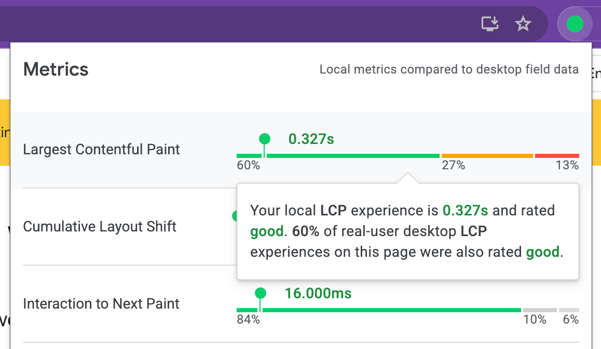
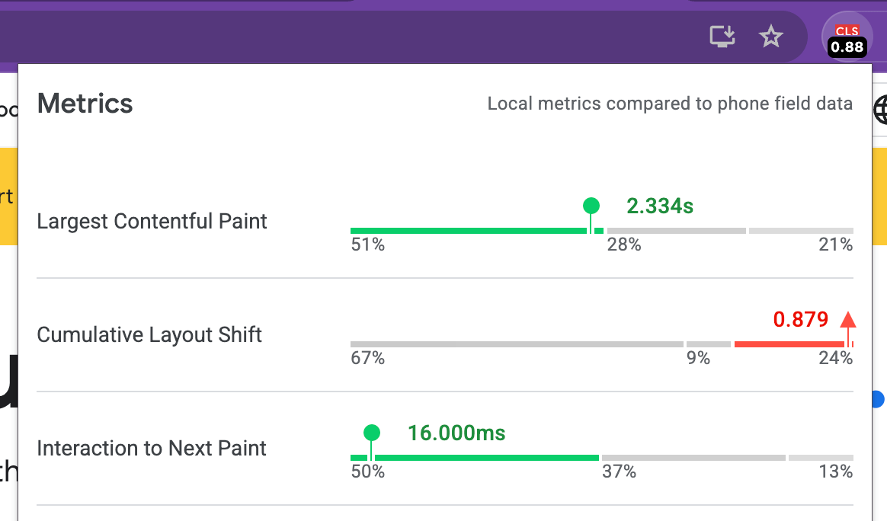
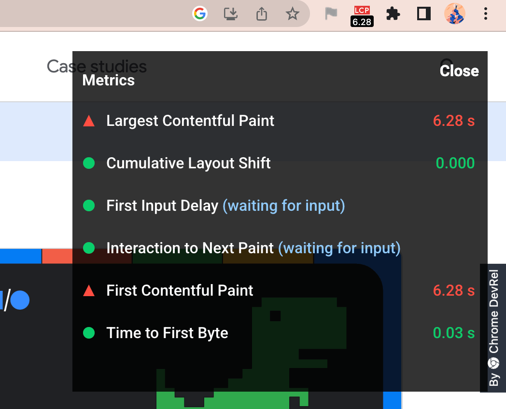

# Web Vitals Chrome Extension 
*A Chrome extension to measure metrics for a healthy site* 
[Install now](https://chrome.google.com/webstore/detail/web-vitals/ahfhijdlegdabablpippeagghigmibma)

This extension measures the three [Core Web Vitals](https://web.dev/vitals) metrics in a way that matches how they're measured by Chrome and reported to other Google tools (e.g. [Chrome User Experience Report](https://developers.google.com/web/tools/chrome-user-experience-report), [Page Speed Insights](https://developers.google.com/speed/pagespeed/insights/), [Search Console](https://search.google.com/search-console/about)).

It supports all of the [Core Web Vitals](https://web.dev/vitals/#core-web-vitals) and leverages the [web-vitals](https://github.com/GoogleChrome/web-vitals) library under the hood to capture:

* [Largest Contentful Paint](https://web.dev/lcp)
* [Cumulative Layout Shift](https://web.dev/cls)
* [First Input Delay](https://web.dev/fid)

<h3 id="install">Installation Instructions</h3>

The Web Vitals Chrome Extenstion can be installed from the [Chrome Web Store](https://chrome.google.com/webstore/detail/web-vitals/ahfhijdlegdabablpippeagghigmibma).

If you are looking for a more bleeding-edge build, you can also install the version of the extension from master.

<h4 id="install-master">Install from master</h4>

**Google Chrome**
1. Download this repo as a [ZIP file from GitHub](https://github.com/googlechrome/web-vitals-extension/archive/master.zip).
1. Unzip the file and you should have a folder named `web-vitals-extension-master`.
1. In Chrome go to the extensions page (`chrome://extensions`).
1. Enable Developer Mode.
1. Drag the `web-vitals-extension-master` folder anywhere on the page to import it (do not delete the folder afterwards).

## Usage

### Ambient badge

The Ambient Badge helps check if a page passing the Core Web Vitals thresholds.

Once installed, the extension will display a disabled state badge icon until you navigate to a URL. At this point it will update the badge to green or red depending on whether the URL passes the Core Web Vitals metrics thresholds.

The badge has a number of states:

* Disabled - gray
* Passing - green
* One or more metrics failing - red

If one or more metrics are failing, the badge will animate the values of these metrics.

### Detailed drill-down

Clicking the Ambient badge icon will allow you to drill in to the individual metric values. In this mode, the extension will also say if a metric value `might change` or requires a user action.

For example, First Input Delay requires a real interaction (e.g click/tap) with the page and will be in a `waiting for input` state until this is the case. We recommend consulting the web.dev documentation for [LCP](https://web.dev/lcp), [CLS](https://web.dev/cls) and [FID](https://web.dev/fid) to get an understanding of when metric values settle.

As of version 1.0.0, the popup combines your local Core Web Vitals experiences with real-user data from the field via the [Chrome UX Report](https://developers.google.com/web/tools/chrome-user-experience-report) (CrUX) [API](https://developers.google.com/web/tools/chrome-user-experience-report/api/reference). This integration gives you contextual insights to help you understand how similar your individual experiences are to other desktop users on the same page. We've also added a new option to "Compare local experiences to phone field data" instead, if needed. Note that CrUX data may not be available for some pages, in which case we try to load field data for the origin as a whole.

### Overlay

The overlay displays a Heads up display (HUD) which overlays your page. It is useful if you need a persistent view of your Core Web Vitals metrics during development. To enable the overlay: 

* Right-click on the Ambient badge and go to Options.
* Check `Display HUD overlay` and click 'Save'
* Reload the tab for the URL you wish to test. The overlay should now be present.

## Contributing

Contributions to this project are welcome in the form of pull requests or issues. See [CONTRIBUTING.md](/CONTRIBUTING.md) for further details.

If your feedback is related to how we measure metrics, please file an issue against [web-vitals](https://github.com/GoogleChrome/web-vitals) directly. 

### How is the extension code structured?

* `src/browser_action/vitals.js`: Script that leverages WebVitals.js to collect metrics and broadcast metric changes for badging and the HUD. Provides an overall score of the metrics that can be used for badging.
* `src/bg/background.js`: Performs badge icon updates using data provided by vitals.js. Passes along
data to `popup.js` in order to display the more detailed local metrics summary.
* `src/browser_action/popup.js`: Content Script that handles rendering detailed metrics reports in the pop-up window displayed when clicking the badge icon.
* `src/options/options.js`: Options UI (saved configuration) for advanced features like the HUD Overlay

## FAQ

**Who is the primary audience for this extension?**

The primary audience for this extension is developers who would like instant feedback on how their pages are doing on the Core Web Vitals metrics during development on a desktop machine.

**How should I interpret the metrics numbers reported by this tool?**

This extension reports metrics for your desktop or laptop machine. In many cases this hardware will be significantly faster than that of the median mobile phone your users may have. For this reason, it is strongly recommended that you test using tools like [Lighthouse](https://developers.google.com/web/tools/lighthouse/) and on real mobile hardware (e.g via [WebPageTest](https://webpagetest.org/easy)) to ensure all your users there have a positive experience.

**What actions can I take to improve my Core Web Vitals?**

We are making available a set of guides for optimizing each of the Core Web Vitals metrics if you find your page is not passing a particular threshold:

* [Optimize CLS](https://web.dev/optimize-cls)
* [Optimize LCP](https://web.dev/optimize-lcp)
* [Optimize FID](https://web.dev/optimize-fid)

Lighthouse 6.0 final will also include additional actionability audits for these metrics. They will answer questions like:

* What element was identified as the Largest Contentful Paint?
* What elements experienced a shift and contributed to Cumulative Layout Shift?

We envision users will use the extension for instant feedback on metrics (for their desktop machine) but will then go and do a Lighthouse audit for (1) a diagnostic view of how these metrics look on a median mobile device and (2) specifically what you can do to improve.

## License

[Apache 2.0](/LICENSE)